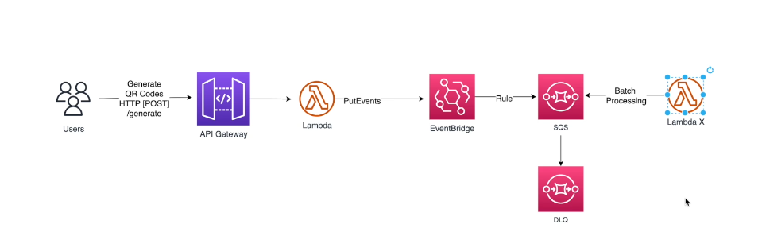

### Deploy serverless application
```
npx serverless deploy
```


`serverless-apigateway-service-proxy` this package is used to communicate with API Gateway and other aws services.

cloudFormation documents for different aws services

**Event Bus**
https://docs.aws.amazon.com/AWSCloudFormation/latest/UserGuide/aws-resource-events-eventbus.html

**SQS**
https://docs.aws.amazon.com/AWSCloudFormation/latest/UserGuide/aws-resource-sqs-queue.html

**Event bridge documentation for javascript SDK**
https://docs.aws.amazon.com/AWSJavaScriptSDK/latest/AWS/EventBridge.html

